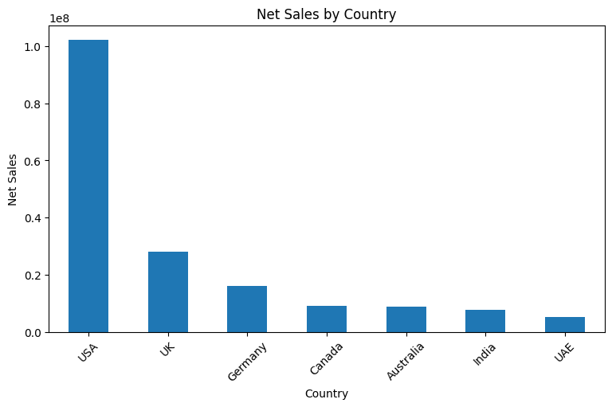
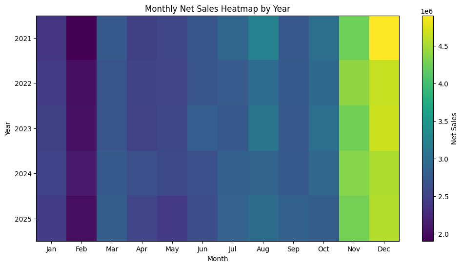

# E-Commerce Exploratory Data Analysis

This project performs an exploratory data analysis (EDA) on a cleaned e-commerce dataset containing more than **138,000 records**.

The goal of the project is to explore sales performance, customer behavior, profitability, seasonality, payment methods, returns, delivery performance, customer satisfaction, geographic markets, coupons, and marketing campaigns.

This analysis is a continuation of my previous **E-Commerce Data Cleaning & Preprocessing project**, where the raw dataset was cleaned and prepared for analysis.

---

## Dataset

The dataset contains e-commerce transactions from **2021 to 2025** and includes information related to:

- Orders and sales
- Customer demographics and segments
- Payment methods
- Delivery performance
- Returns
- Customer ratings and reviews
- Marketing campaigns
- Coupons
- Profitability
- Customer Lifetime Value

**Original Dataset:**  
https://www.kaggle.com/datasets/datascikhan/e-commerce-sales-and-customer-analytics

**Data Cleaning Project:**  
https://github.com/robaabuamara/ecommerce-data-cleaning

---

## Project Objectives

The analysis focuses on answering questions such as:

- How did sales change between 2021 and 2025?
- Are there seasonal patterns in e-commerce sales?
- Which sales channels generate the most revenue?
- Which customer segments contribute the most to sales and profit?
- How do repeat customers differ from one-time customers?
- Which markets generate the highest sales?
- Which payment methods are used most frequently?
- What are the most common reasons for product returns?
- How closely do actual delivery times match estimated delivery times?
- Is delivery performance associated with customer satisfaction?
- Does coupon usage affect sales or profitability?
- Can marketing campaigns explain the seasonal increase in sales?

---

## Analysis Sections

- Data Loading & Overview
- Time & Seasonality Analysis
- Sales Channel Analysis
- Customer Segment & Profitability Analysis
- Repeat Customer Analysis
- Geographic Analysis
- Payment Methods Analysis
- Returns Analysis
- Delivery Analysis
- Ratings & Reviews Analysis
- Marketing & Coupons Analysis
- Final Insights
- Business Recommendations
- Conclusion

---

## Key Insights

### Sales & Seasonality

Annual net sales remained highly stable between **2021 and 2025**, with year-over-year changes staying within approximately **±1.1%**.

A clear seasonal pattern appeared across all five years. **November and December consistently recorded the highest sales**, while February generally recorded the lowest.

---

### Sales Channels

**Mobile App** and **Website** generated the highest total net sales.

However, average order values were very similar across all sales channels. This suggests that their higher total sales were mainly driven by a **larger number of orders rather than higher-value purchases**.

---

### Customer Segments & Profitability

The **Consumer** segment generated the highest total sales and profit, largely because it contained the largest number of orders.

Average order values were very similar across customer segments.

Using a weighted profit margin calculation:

- Consumer: approximately **44.1%**
- Business: approximately **43.8%**
- VIP: approximately **41.1%**
- Premium: approximately **41.1%**

---

### Repeat Customers

Approximately **98.7% of unique customers** in the dataset were classified as repeat customers.

Repeat customers had a much higher recorded average Customer Lifetime Value:

- Repeat customers: approximately **7,809**
- One-time customers: approximately **1,304**

This comparison should be interpreted carefully because the dataset contains relatively few one-time customers and the exact CLV calculation used by the dataset is not documented in this analysis.

---

### Geographic Markets

The **USA** generated the highest total net sales by a substantial margin.

After excluding the USA to better compare the remaining markets, the strongest markets were:

1. UK
2. Germany
3. Canada
4. Australia
5. India
6. UAE

---

### Payment Methods

**Credit Card** was the most frequently used payment method and generated the highest total sales.

However, average order values were relatively similar across payment methods.

Payment preferences were also highly consistent across sales channels:

- Credit Card: approximately **30%**
- Debit Card: approximately **20%**
- PayPal: approximately **15%**

---

### Returns

Approximately **6.85% of orders were returned**.

Return reasons were distributed relatively evenly, with no single reason strongly dominating the others.

Return rates were also very similar across sales channels and customer segments.

---

### Delivery Performance

Delivery analysis was based on **113,559 orders**, representing approximately **82.2% of the dataset**, because the remaining records did not contain delivery or rating information.

Delivery performance was generally close to expectations:

- On Time: approximately **77%**
- Late: approximately **15%**
- Early: approximately **8%**

The median delivery delay was **0 days**, while the average delay was around **0.26 days**.

---

### Delivery & Customer Satisfaction

One of the strongest patterns in the analysis was the relationship between delivery performance and customer satisfaction.

Average customer ratings were approximately:

- Early delivery: **4.02**
- On-time delivery: **3.73**
- Late delivery: **3.22**

Review sentiment showed a similar pattern:

- Early deliveries: approximately **90.5% positive reviews**
- On-time deliveries: approximately **73.8% positive reviews**
- Late deliveries: approximately **30.6% positive reviews**

This suggests a strong association between delivery performance and customer satisfaction.

---

### Ratings & Reviews

The average customer rating was approximately **3.68 out of 5**, with a median of **3.7**.

Most customer reviews were positive:

- Positive: approximately **68.8%**
- Neutral: approximately **30.5%**
- Negative: less than **1%**

Review sentiment was also consistent with numerical customer ratings.

---

### Coupons

Approximately **20% of orders used a coupon**, and coupon usage remained very stable throughout the year.

Orders with and without coupon codes showed very similar average net sales, discount amounts, and profit.

Because discounts were also present on orders without coupon codes, the `discount_amount` field likely reflects additional types of discounts beyond coupon usage.

Coupon usage did not noticeably increase during November or December, meaning that the end-of-year sales increase was not primarily explained by higher coupon usage.

---

### Marketing Campaigns

The proportion of orders associated with a known campaign remained relatively stable at approximately **39–40% throughout the year**.

There was no noticeable increase in known campaign activity during November or December.

Among known campaigns, **Affiliate_Partner** recorded the highest average net sales per order, while **Weekly_Newsletter** recorded the lowest.

A large proportion of campaign values were unknown, so campaign-related conclusions should be interpreted cautiously.

---

## Recommendations

- Prepare inventory and delivery capacity for **November and December**, when sales consistently increase.
- Prioritize reducing delivery delays because late deliveries were associated with lower customer ratings and fewer positive reviews.
- Improve marketing campaign tracking because a large proportion of campaign information is unknown.
- Investigate non-coupon discount sources to better understand discount effectiveness and profitability.

---

## Limitations

- The dataset contains relatively few one-time customers compared with repeat customers.
- The exact calculation used for `customer_lifetime_value` is not documented in this analysis.
- A large proportion of campaign information was originally missing and labeled as `Unknown Campaign`.
- Delivery and rating analyses cover approximately **82.2% of the dataset**.
- Relationships identified in this EDA represent **associations and do not prove causation**.

---

## Technologies Used

- Python
- Pandas
- NumPy
- Matplotlib
- Kaggle Notebooks
- Jupyter Notebook
- GitHub

---

## Repository Structure

- `e-commerce-exploratory-data-analysis.ipynb`
- `README.md`

---

## Kaggle Notebook

The complete notebook with code, outputs, tables, and visualizations is available on Kaggle.

**Kaggle Notebook:**  
https://www.kaggle.com/code/robaabuamara/e-commerce-exploratory-data-analysis

## How to Run

1. Download or clone this repository.
2. Download the original dataset from Kaggle.
3. Use the cleaned dataset produced in the related Data Cleaning project.
4. Open the notebook in Kaggle, Jupyter Notebook, or Google Colab.
5. Update the dataset path if necessary.
6. Run the notebook cells in order.

---

## Project Background

This project was created as a practical continuation of my learning in **Data Cleaning and Data Analysis**.

After cleaning and preprocessing the original e-commerce dataset, I used the cleaned data to practice exploratory data analysis, visualization, business-oriented questioning, and interpreting patterns rather than simply generating charts.

The project helped strengthen my practical skills in **Python, Pandas, Exploratory Data Analysis, Data Visualization, and Business Data Analysis**.
